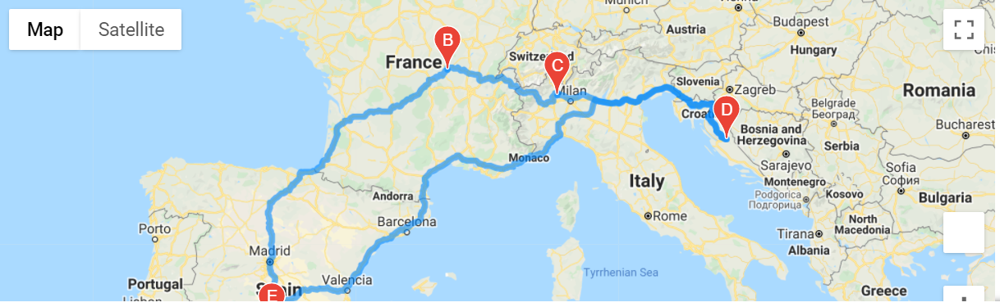
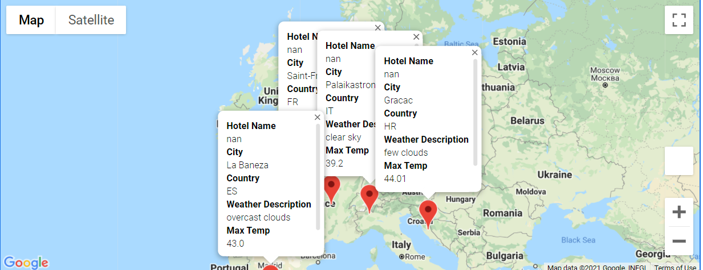

# World_Weather_Analysis

## Project Overview
PlanMyTrip app is a top travel technology company specialized in internet related services in the hotel and lodging industry.\
This project will enhance the user interface  and functionalities of the PlanMyTrip app with the following steps: 
Delieverable 1. Retrieve weather data including the weather description for over 500 cities across the world generated randomly,
Deliverable  2. Create a Customer Travel Destinations map based on temperature input from the clien,
Deliverable  3. Create a Travel Itinerary map.

## Resources
- Data Source: [citipy](https://github.com/wingchen/citipy), [jupyter-gmaps](https://jupyter-gmaps.readthedocs.io/en/latest/), [OpenWeatherMap API](https://openweathermap.org/current), [Google Maps and Places API](https://developers.google.com/places/web-service/search), [Google Maps Directions API](https://developers.google.com/maps/documentation/directions/overview)
- Software: Python 3.7.7, Anaconda Navigator 1.9.12, Conda 4.8.4, Jupyter Notebook 6.0.3

## Results

### Retrieve weather data
The app uses the NumPy dependency to generate 2,000 random sets of coordinates (latitude and longitude).\
The Python's [citipy](https://github.com/wingchen/citipy) module is then called to identify the nearest city for each coordinate combination.\
The weather data is retrieved for all identified cities through a request to the [OpenWeatherMap API](https://openweathermap.org/current).  We ask the user to input the desired temperature.  In my case I selected 45F as the minimum temperature and 95F as the maximum temperature.\
The end results was a file with 377 cities that met this temperature requirement.

### Create a customer travel destinations map
With Jupyter's gmaps plugin, user's weather preference inputs and requests to the [Google Maps and Places API](https://developers.google.com/places/web-service/search), the app generates a customer travel destinations map.

  
  Destinations map 

### Create a travel itinerary map
Using [Google Maps Directions API](https://developers.google.com/maps/documentation/directions/overview) the app generates a travel route between 4 cities selected by the user.  In this case the user selected: 
'start_city = "La Baneza"'/
city1 = "Saint-Francois"/
city2 = "Palaikastron"/
city3 = "Mobaye"/
end_city = "La Baneza"/

  Travel Map
   
  Travel map 

  Travel map with markers  
  
  Travel map with markers 

